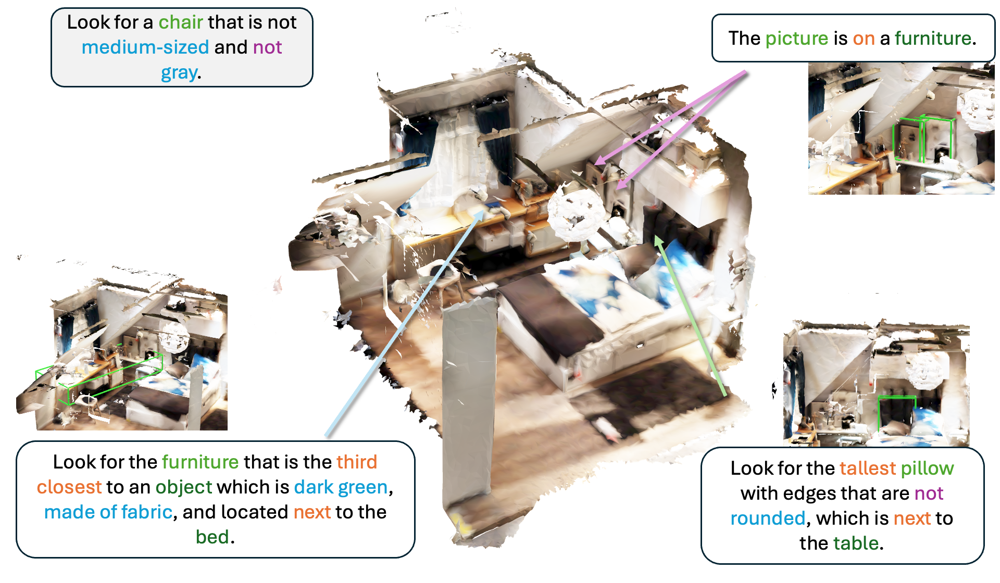

# ViGiL3D++: Scaling Diverse Language Generation for 3D Visual Grounding

[Austin T. Wang](https://atwang16.github.io)1, [Dongchen Yang](https://www.sfu.ca/~dya78/)1, [Angel X. Chang](https://angelxuanchang.github.io/)1, 2

1Simon Fraser University, 2Alberta Machine Intelligence Institute (Amii)

This repository contains the implementation for ViGiL3D++, an evaluation dataset and benchmark for open-vocabulary visual grounding methods on 3D scenes with diverse linguistic patterns.

**Code coming soon!**